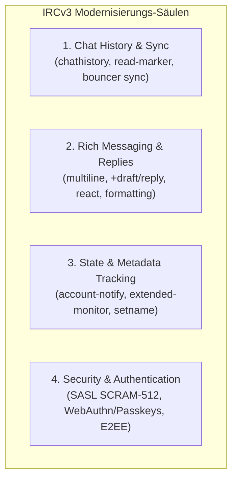

<!-- SPDX-License-Identifier: GPL-2.0-or-later -->
<!-- HexChat (Avalonia Port) - FUTURE-PLAN.md -->
<!-- Description: Zukunftsplan für die Weiterentwicklung des Clients nach Abschluss des 1:1 Ports (Fokus: IRCv3 & moderne Protokoll-Standards). -->

# 🚀 HexChat Future Plan — Post-Port Evolution & IRCv3 Integration

> **Strategischer Entwicklungsplan für die Weiterentwicklung nach erfolgreicher Fertigstellung des 1:1 HexChat-Ports**  
> Projekt-Baseline: **HexChat (.NET 10 & Avalonia UI 12)** | Ausrichtung: **[IRCv3 Working Group Standards](https://ircv3.net)** | Zielversion: **v3.0+**

---

## 🎯 1. Strategische Einordnung & Grundsatz

> [!IMPORTANT]
> **Prioritäts-Klarstellung:**
>
> 1. **Phase 1 bis 7 ([`ROADMAP.md`](file:///d:/Quelltext/hexchat/ROADMAP.md)):** Absolute Priorität hat die **vollständige, lückenlose 1:1 Portierung** des klassischen HexChat-Clients von C/GTK auf .NET 10 und Avalonia UI 12. Alle Menüs, Dialoge, 70+ Slash-Commands und Konfigurationsoptionen müssen paritär funktionieren.
> 2. **Nach erfolgreichem Port (Post-v2.x / v3.0+):** Nach Erreichen der vollständigen Parität schlägt dieses Projekt den Weg eines **modernen, zukunftssicheren Next-Gen IRC-Clients** ein, der sich strikt an den Standards und Spezifikationen der **IRCv3 Working Group** und modernen IRC-Server-Entwicklungen (z. B. Ergo, InspIRCd, UnrealIRCd, Soju, ZNC) orientiert.

---

## 🌐 2. Kern-Fokus: Umfassende IRCv3-Unterstützung

Das IRCv3-Projekt modernisiert das klassische RFC 1459/2812 Protokoll. Nach dem Basis-Port wird HexChat zu einem der modernsten IRCv3-kompatiblen Desktop-Clients ausgebaut:

---

### A. Nachrichtenverlauf & Multi-Client Synchronisation

- [ ] **`chathistory`:** Abrufen von serverseitigem Nachrichtenverlauf beim Betreten von Kanälen oder nach Verbindungsabbrüchen ohne Reconnect-Verlust.
- [ ] **`draft/read-marker`:** Synchronisation des Gelesen-Status über Bouncer (ZNC, Soju, Ergo) hinweg auf alle Clients und Geräte.
- [ ] **`draft/event-playback`:** Nahtloses Nachladen vergangener Chat-Events (Joins, Parts, Kicks, Topic-Änderungen) mit echten historischen Zeitstempeln (`server-time`).
- [ ] **`echo-message`:** Verlässliche Bestätigung gesendeter Nachrichten durch den Server, um absolute Konsistenz in verteilten Umgebungen zu gewährleisten.
- [ ] **`labeled-response` & `standard-replies`:** Präzise Zuordnung von Server-Rückmeldungen, Fehlermeldungen und Bestätigungen zu konkreten Client-Befehlen.

---

### B. Modernes Messaging, Formatierung & Interaktion

- [ ] **`draft/multiline`:** Echte mehrzeilige Nachrichten (für Code-Snippets, Logs und lange Textblöcke) ohne zeilenweises Flood-Risiko.
- [ ] **`+draft/reply` (Message Threads & Direktantworten):** Antworten auf spezifische Nachrichten mit visueller Thread-Zuordnung und Zitat-Vorschau.
- [ ] **`+draft/react` (Reaktionen / Emoji-Reactions):** Native Unterstützung für Emoji-Reaktionen an Chat-Nachrichten auf modernen IRC-Netzen.
- [ ] **`draft/message-redaction`:** Bearbeiten (*Edit*) und Zurückziehen (*Delete/Redact*) von Nachrichten bei Servern mit entsprechender Berechtigung.
- [ ] **Erweiterte Medien- & Link-Vorschau:** Optionale, datenschutzfreundliche Inline-Vorschau für Links, Bilder und Code-Syntax-Highlighting.

---

### C. Echtzeit-Zustand & Netzwerk-Metadaten

- [ ] **`account-notify` & `extended-join`:** Automatische Nachverfolgung von Benutzer-Accounts und Realnames beim Join ohne periodisches `/WHO` Polling.
- [ ] **`away-notify`:** Sofortige Benachrichtigung über Statuswechsel (Away / Back) anderer Benutzer in gemeinsamen Kanälen.
- [ ] **`draft/extended-monitor`:** Leistungsfähige Freundes- und Überwachungsliste (`MONITOR`) mit Metadaten, Avataren und Account-Status.
- [ ] **`draft/channel-rename`:** Dynamisches Umbenennen von Kanälen auf Server-Ebene ohne Part/Rejoin-Zyklen.
- [ ] **`setname`:** Dynamische Aktualisierung des Realnames zur Laufzeit.
- [ ] **`cap-notify`:** Dynamisches Hinzufügen und Entfernen von Server-Capabilities ohne Neuverbindung.

---

### D. Sicherheit, Authentifizierung & Kryptographie

- [ ] **Erweiterte SASL-Mechanismen:** Volle Unterstützung für `SCRAM-SHA-512`, `OAUTHBEARER` und moderne Token-basierte Logins.
- [ ] **`draft/account-registration`:** Registrieren neuer IRC-Konten direkt aus dem Client ohne NickServ-Kommandos im Raw-Chat.
- [ ] **Modernes End-to-End Encryption (E2EE):** Integration moderner E2EE-Protokolle (z. B. OTR v4 oder Signal/MLS-basierte Ratchet-Protokolle) als zeitgemäßer Ersatz für das alte Blowfish (FiSHLiM).
- [ ] **Strikte TLS 1.3 & DANE/TLSA Unterstützung:** Höchste Sicherheitsstandards für verschlüsselte Socket-Verbindungen.

---

## 🧩 3. Architektur- & Plattform-Evolution

Neben den Protokoll-Spezifikationen von IRCv3 sind folgende architektonische Weiterentwicklungen geplant:

| Bereich | Geplante Innovation | Ziel |
| :--- | :--- | :--- |
| **Plugin-Ökosystem** | **.NET 10 / C# Plugin SDK & WebAssembly** | Sichere, sandboxed Erweiterungen mit moderner API neben Python 3. |
| **Bouncer Integration** | **Ergo / Soju / ZNC First-Class Support** | Spezialisierte Verwaltung von Bouncer-Netzwerken und Multi-Device-Settings. |
| **UI-Anpassbarkeit** | **XAML Styles, Themes & Layout-Engine** | Vollständig frei anpassbare Layouts, Themes, Schriftarten und Icon-Sets. |
| **Accessibility (a11y)** | **Screenreader & Tastaturnavigation** | Vollständige Barrierefreiheit nach WCAG-Standards für Desktop-Nutzer. |
| **Performance** | **Zero-Allocation Buffer & Virtualisierung** | Flüssiges Rendern bei extremem Durchsatz (100.000+ Nachrichten/Sekunde). |

---

## 🗺️ 4. Zusammenhang mit bestehenden Dokumenten

- **Master Roadmap:** [`ROADMAP.md`](file:///d:/Quelltext/hexchat/ROADMAP.md) — Definiert die aktuellen Phasen 1 bis 7 für den 1:1 Port.
- **Paritätsmatrix:** [`docs/PARITY_MATRIX.md`](file:///d:/Quelltext/hexchat/docs/PARITY_MATRIX.md) — Tracking des bestehenden C-Codes.
- **Befehls-Parität:** [`docs/COMMANDS_PARITY.md`](file:///d:/Quelltext/hexchat/docs/COMMANDS_PARITY.md) — Katalog der bestehenden 70+ Slash-Commands.
- **Regelwerk:** [`AGENTS.md`](file:///d:/Quelltext/hexchat/AGENTS.md) & [`.agents/CONTEXT.md`](file:///d:/Quelltext/hexchat/.agents/CONTEXT.md) — Orientierung für Entwickler und KI-Assistenten.
