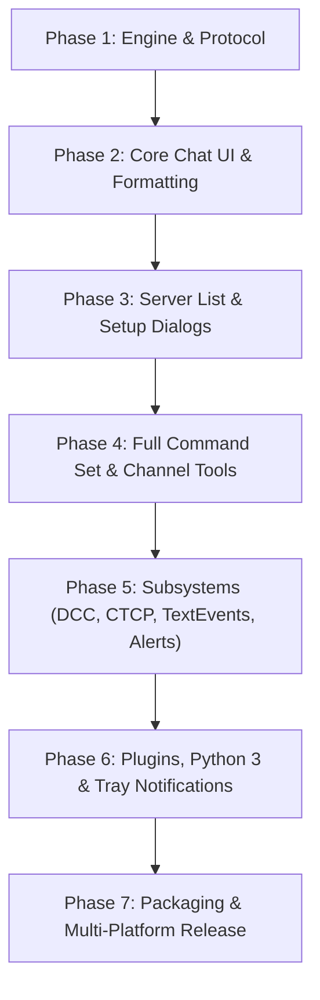

<!-- SPDX-License-Identifier: GPL-2.0-or-later -->
<!-- HexChat (Avalonia Port) - ROADMAP.md -->
<!-- Description: Master-Roadmap, Meilensteine und Fortschritts-Dashboard für den HexChat C# / Avalonia 12 Port. -->

# 🗺️ HexChat (.NET 10 & Avalonia UI) — Master Roadmap & Progress Dashboard

> **Plattformübergreifender 1:1 Port des klassischen HexChat IRC-Clients**  
> Architektur: **3-Tier MVVM & Reactive IRC Engine** | Sprache: **C# 13 / .NET 10** | UI-Framework: **Avalonia UI 12** | Lizenz: **GPL-2.0-or-later**

---

## 🎯 1. Vision & Leitprinzipien

Das Ziel dieses Projekts ist die **vollständige, kompromisslose 1:1 Portierung** aller Funktionen, Dialoge, Menüs, Einstellungen, Befehle, Subsysteme und Scripting-Schnittstellen des originalen HexChat IRC-Clients auf modernste .NET-Technologien:

1. **100% Funktionale Parität:** Jedes Untermenü, jeder Einstellungsreiter, jeder Slash-Befehl und jedes Feature aus dem originalen C/GTK2-Codebase (`legacy/`) wird im modernen C# / Avalonia UI-Stack implementiert.
2. **Reaktive & performante IRC-Engine:** Low-Allocation Message-Parsing mit `ReadOnlySpan<char>`, asynchrone I/O-Pipelines (`System.IO.Pipelines`), saubere Trennung von Protokoll, Zustand und UI.
3. **Moderne Desktop-Erfahrung:** Flüssige Fluent-Oberfläche mit Avalonia UI 12, voller Theme-Unterstützung (Dark/Light/High Contrast), Unterstützung für mIRC-Farben & 24-Bit TrueColor, native System-Tray- und Benachrichtigungs-Integration auf Windows, Linux und macOS.
4. **Testgetriebene Qualität:** Jede Protokollregel, jeder Zustandsübergang und jeder Parser wird durch deterministische xUnit-Tests in [`tests/HexChat.Core.Tests`](file:///d:/Quelltext/hexchat/tests/HexChat.Core.Tests) abgesichert.

---

## 📊 2. Fortschritts-Dashboard

```text
Gesamtforschritt: [████░░░░░░░░░░░░░░░░] 22% Fertiggestellt
```

| Phase | Fokusbereich | Status | Fertigstellung | Detail-Tracking |
| :--- | :--- | :---: | :---: | :--- |
| **Phase 1** | Foundation, IRC-Protokoll & Netzwerk-Engine | 🟨 In Arbeit | 80% | [Paritätsmatrix: Protokoll](docs/PARITY_MATRIX.md#bereich-d-irc-protokoll-numerics--ircv3-capabilities) |
| **Phase 2** | Core Chat-UI, Message-Rendering & Buffer | 🟨 In Arbeit | 45% | [Paritätsmatrix: Views](docs/PARITY_MATRIX.md#bereich-a-fenster-dialoge--ui-views) |
| **Phase 3** | Netzwerkliste, Server-Verwaltung & Einstellungen | 🟨 In Arbeit | 25% | [Menü- & Dialog-Parität](docs/MENUS_AND_UI_PARITY.md#2-einstellungen--preferences-dialog-setupc) |
| **Phase 4** | IRC Command Set (70+ Befehle) & Channel-Management | 🟨 In Arbeit | 20% | [Befehls-Paritätsmatrix](docs/COMMANDS_PARITY.md) |
| **Phase 5** | Subsysteme: DCC, CTCP, Alerts, URL Grabber, Text Events | ⬜ Geplant | 10% | [Paritätsmatrix: Subsysteme](docs/PARITY_MATRIX.md#bereich-g-subsysteme-ctcp-dcc-url-sound-text-events) |
| **Phase 6** | Plugin-Architektur, Python 3 Scripting & Tray/OS-Events | ⬜ Geplant | 5% | [Paritätsmatrix: Plugins](docs/PARITY_MATRIX.md#bereich-h-plugins-scripting--erweiterungen) |
| **Phase 7** | Multi-Platform Packaging, CI/CD & Performance-Polish | ⬜ Geplant | 10% | [CI Workflow](file:///d:/Quelltext/hexchat/.github/workflows/dotnet-build.yaml) |

> **Legende:** 🟩 Abgeschlossen (Done) | 🟨 In Entwicklung (In Progress) | ⬜ Geplant (Planned)

---

## 🧭 3. Detaillierte Phasen & Meilensteine



---

### 🔹 Phase 1: Foundation, IRC-Protokoll & Netzwerk-Engine (80%)

> **Ziel:** Robuste, hochperformante Verbindung zu IRC-Servern mit TLS, SASL, IRCv3 und RFC-Konformität.

- [x] **IRC Message-Parser:** RFC 1459/2812 Message-Parsing mit Tags, Prefix, Command, Parameters ([`IrcMessage.cs`](file:///d:/Quelltext/hexchat/src/HexChat.Core/Protocol/IrcMessage.cs)).
- [x] **IRC Numerics:** Vollständige Enumeration der RFC- und IRCv3-Numerics ([`IrcNumerics.cs`](file:///d:/Quelltext/hexchat/src/HexChat.Core/Protocol/IrcNumerics.cs)).
- [x] **Message Tags & IRCv3:** Parser für IRCv3 Message Tags (`server-time`, `account-tag`, `msgid` etc.) ([`IrcTags.cs`](file:///d:/Quelltext/hexchat/src/HexChat.Core/Protocol/IrcTags.cs)).
- [x] **Netzwerk-Verbindung:** Asynchrone TCP- und TLS/SSL-Socket-Verbindung mit Stream-Pipelines ([`IrcConnection.cs`](file:///d:/Quelltext/hexchat/src/HexChat.Core/Network/IrcConnection.cs)).
- [x] **SASL-Authentifizierung:** PLAIN ([`SaslPlain.cs`](file:///d:/Quelltext/hexchat/src/HexChat.Core/Security/SaslPlain.cs)) und SCRAM-SHA-256 ([`SaslScramSha256.cs`](file:///d:/Quelltext/hexchat/src/HexChat.Core/Security/SaslScramSha256.cs)).
- [x] **Core Client State:** Server-, Channel- und User-Zustandsmodelle ([`IrcClient.cs`](file:///d:/Quelltext/hexchat/src/HexChat.Core/State/IrcClient.cs), [`IrcChannel.cs`](file:///d:/Quelltext/hexchat/src/HexChat.Core/State/IrcChannel.cs), [`IrcUser.cs`](file:///d:/Quelltext/hexchat/src/HexChat.Core/State/IrcUser.cs)).
- [ ] **Erweiterte SASL-Mechanismen:** SASL EXTERNAL (Client-Zertifikat / CertFP) und SCRAM-SHA-1.
- [ ] **Proxy-Unterstützung:** SOCKS4, SOCKS5, HTTP CONNECT und Tor/Onion Support.
- [ ] **Identd-Server:** Integrierter lokaler Ident-Daemon für RFC 1413 Ident-Abfragen.

---

### 🔹 Phase 2: Core Chat-UI, Message-Rendering & Buffer (45%)

> **Ziel:** Flüssige und reaktive Benutzeroberfläche in Avalonia 12 für Kanäle, Queries und Server-Konsolen.

- [x] **Hauptfenster-Layout:** MVVM MainWindow mit Channel-Liste, Chat-Bereich, User-Liste und Eingabezeile ([`MainWindow.axaml`](file:///d:/Quelltext/hexchat/src/HexChat.UI/Views/MainWindow.axaml)).
- [x] **mIRC Farb- & Format-Parser:** Unterstützung für Farbcodes (\x03), Fett (\x02), Kursiv (\x1D), Unterstrichen (\x1F) ([`MircColorParser.cs`](file:///d:/Quelltext/hexchat/src/HexChat.Core/Formatting/MircColorParser.cs)).
- [ ] **Channel Switcher Umschaltung:** Wahlweise Tabs (oben/unten) oder TreeView (links) analog zu HexChat C-GTK (`chanview-tabs.c` / `chanview-tree.c`).
- [ ] **Topic Bar:** Interaktive Topic-Leiste mit Editier-Dialog und Topic-Historie (`maingui.c`).
- [ ] **Erweiterte Userliste:** Sortierung nach Rängen (`~`, `&`, `@`, `%`, `+`, reguläre Nicks), Farbmarkierungen und Schnell-Aktionsbuttons (`userlistgui.c`).
- [ ] **Rich-Text ChatView:** Hochperformanter virtueller Scroll-Buffer mit Hyperlink-Erkennung, Nick-Coloring (deterministisches Hash-Coloring), Zeitstempeln und Auswahl-Kopieren (`xtext.c`).
- [ ] **Marker Line:** Rote Trennlinie für ungelesene Nachrichten (`Reset Marker Line`, `Move to Marker Line`).
- [ ] **Eingabezeile & Historie:** Befehls-Historie (Pfeil nach oben/unten), Nick-Vervollständigung (Tab-Completion) und Auto-Replace (`sexy-spell-entry.c`).

---

### 🔹 Phase 3: Netzwerkliste, Server-Verwaltung & Einstellungen (25%)

> **Ziel:** Vollständige Konfigurierbarkeit aller Netzwerke, Server, Passwörter und Client-Optionen.

- [ ] **Netzwerkliste & Server-Manager:** Kompletter Dialog zur Verwaltung von IRC-Netzen, Server-Adressen, Ports, TLS, Passwörtern, Auto-Connect und Auto-Join (`servlistgui.c` $\rightarrow$ `ServerListView.axaml`).
- [ ] **Vordefinierte Netzwerke:** Import und Bereitstellung aller Standard-Netzwerke (Libera.Chat, OFTC, EFnet, Undernet, DALnet, QuakeNet, IRCNet, Rizon, EsperNet etc.) (`servlist.conf`).
- [ ] **Einstellungen / Preferences Dialog:** 11 Konfigurationsreiter (`setup.c` $\rightarrow$ `PreferencesView.axaml`):
  - *Interface:* Appearance, Input Box, User List, Channel Switcher, Colors & Palette.
  - *Chatting:* General, Alerts & Notifications, Sounds, Logging, Advanced.
  - *Network:* Network Setup, File Transfers (DCC), Identd.
- [ ] **Konfigurations-Persistenz:** Sichere, typsichere JSON/YAML-Konfiguration mit automatischer Migration bestehender `hexchat.conf`-Dateien.

---

### 🔹 Phase 4: IRC Command Set (70+ Befehle) & Channel-Management (20%)

> **Ziel:** 100% Unterstützung aller Slash-Befehle (`/JOIN`, `/MSG`, `/BAN`, `/KICK`, `/EXEC`, `/TOPIC`, `/MODE` etc.).

- [x] **Command-Router:** Grundlegender Slash-Befehl-Handler ([`HexChatCommandHandler.cs`](file:///d:/Quelltext/hexchat/src/HexChat.Core/Commands/HexChatCommandHandler.cs)).
- [ ] **Vollständiges Command-Set:** Alle 70+ internen HexChat-Befehle implementieren (siehe [`docs/COMMANDS_PARITY.md`](docs/COMMANDS_PARITY.md)).
- [ ] **Kanal-Listen-Dialog:** Kanal-Suche mit Filter nach Namen, Benutzeranzahl, Topic und Regex (`chanlist.c` $\rightarrow$ `ChannelListView.axaml`).
- [ ] **Ban / Quiet / Invite / Except Listen:** Verwaltungsdialog für Kanal-Bannmasken (`banlist.c` $\rightarrow$ `BanListView.axaml`).
- [ ] **Raw Log Fenster:** Protokoll-Inspektor für Roh-Traffic mit Inbound/Outbound-Filtern (`rawlog.c` $\rightarrow$ `RawLogView.axaml`).
- [ ] **Join Channel Dialog:** Schnelldialog für Kanalname & Passwort (`joind.c` $\rightarrow$ `JoinChannelView.axaml`).

---

### 🔹 Phase 5: Subsysteme: DCC, CTCP, Alerts, URL Grabber, Text Events (10%)

> **Ziel:** Alle Power-User-Features und Protokoll-Erweiterungen.

- [ ] **CTCP-Engine:** Client-to-Client Protocol (PING, TIME, VERSION, CLIENTINFO, USERINFO, FINGER, SOUND, ACTION) und benutzerdefinierte CTCP-Replies (`ctcp.c` / `editlist.c`).
- [ ] **DCC-Subsystem:** DCC SEND (aktiver & passiver Modus, NAT-Traversal, Resume), DCC RECV mit Prüfsummen-Validierung und DCC CHAT (Direct Peer-to-Peer Chat) (`dcc.c`, `dccgui.c`).
- [ ] **Freunde- & Notify-Liste:** Online/Offline-Statusüberwachung (`notify.c`, `notifygui.c`).
- [ ] **Ignore-Engine:** Globale & netzwerk-spezifische Ignorier-Regeln (PRIVMSG, NOTICE, CHANNEL, CTCP, DCC, INVITE) (`ignore.c`, `ignoregui.c`).
- [ ] **URL Grabber:** Automatische Erfassung von Links in Chat-Nachrichten mit Filterung und Browser-Start (`urlgrab.c`).
- [ ] **Text Events Editor:** Anpassung aller Chat-Nachrichten-Formate (`pevents.conf`, `textgui.c`).
- [ ] **Tastenkombinationen & F-Keys:** Frei belegbare Shortcuts und Tastenbefehle (`fkeys.c`).
- [ ] **User Commands & Aliase:** Eigene Makros und Befehls-Aliase mit Parameter-Ersetzung (`editlist.c`).

---

### 🔹 Phase 6: Plugin-Architektur, Python 3 Scripting & Tray/OS-Events (5%)

> **Ziel:** Volle Erweiterbarkeit und moderne Betriebssystem-Integration.

- [ ] **C# Native Plugin Architecture:** Schnittstelle für Drittanbieter-Plugins in .NET.
- [ ] **Python 3 Scripting Engine:** Volle Unterstützung für HexChat Python-Skripte (`hexchat.prnt`, `hexchat.hook_command`, `hexchat.hook_server` etc.) via Python.NET oder Native Interop (`plugins/python/`).
- [ ] **System Tray & Badges:** Tray-Icon mit Status-Anzeige, Blink-Option und Kontextmenü (`plugin-tray.c`).
- [ ] **Native OS Notifications:** Plattformnative Desktop-Benachrichtigungen für Highlights, private Nachrichten und DCC-Anfragen.
- [ ] **FiSHLiM Verschlüsselung:** Blowfish CBC/ECB Verschlüsselung für sichere IRC-Kommunikation (`plugins/fishlim/`).
- [ ] **SysInfo Plugin:** Systeminformationen ausgeben (`/sysinfo`) für Windows, Linux und macOS (`plugins/sysinfo/`).

---

### 🔹 Phase 7: Multi-Platform Packaging, CI/CD & Performance-Polish (10%)

> **Ziel:** Ein-Klick-Installation und makellose Ausführung auf allen Zielplattformen.

- [x] **GitHub Actions CI:** Automatisierter Build & Testlauf auf allen Commits & PRs ([`dotnet-build.yaml`](file:///d:/Quelltext/hexchat/.github/workflows/dotnet-build.yaml)).
- [ ] **Windows Installer:** Native MSIX / InnoSetup Installer inklusive Startmenü- und Protokoll-Registrierung (`irc://`, `ircs://`).
- [ ] **Linux Packaging:** Flatpak, AppImage und deb/rpm Pakete.
- [ ] **macOS Bundle:** Notarisierte `.app` und `.dmg` Pakete mit Apple Silicon (arm64) und Intel (x64) Support.
- [ ] **Memory & CPU Profiling:** Minimierung von Allokationen bei High-Traffic Channels (z. B. #twitch, 10.000+ User).

---

## 📑 4. Paritäts-Dokumente & Navigationsindex

Zur lückenlosen Nachverfolgung aller Details existieren spezialisierte Paritätsmatrizen im Ordner [`docs/`](docs/):

| Dokument | Inhalt & Zweck |
| :--- | :--- |
| **[`FUTURE-PLAN.md`](FUTURE-PLAN.md)** | **Post-Port Zukunftsplan:** Strategische Weiterentwicklung des Clients nach dem Port mit vollem Fokus auf IRCv3-Standards. |
| **[`docs/PARITY_MATRIX.md`](docs/PARITY_MATRIX.md)** | **Master-Paritätsmatrix:** Alle C-Quellcodedateien (`legacy/src/`) und Module gegenüber ihren C#-Gegenstücken. |
| **[`docs/COMMANDS_PARITY.md`](docs/COMMANDS_PARITY.md)** | **Befehls-Parität:** Alle 70+ internen Slash-Befehle, Syntax, Flags und Implementierungsstatus. |
| **[`docs/MENUS_AND_UI_PARITY.md`](docs/MENUS_AND_UI_PARITY.md)** | **Menü- & UI-Parität:** Vollständige Menüstruktur, Untermenüs, Tastenkürzel, Preferences-Tabs und Popups. |
| **[`.agents/checklists/porting-c-to-avalonia.md`](file:///d:/Quelltext/hexchat/.agents/checklists/porting-c-to-avalonia.md)** | **Entwickler-Checkliste:** Schritt-für-Schritt Leitfaden zur Portierung einzelner C-Dialoge nach Avalonia. |
| **[`.agents/skills/hexchat-dev-workflow/SKILL.md`](file:///d:/Quelltext/hexchat/.agents/skills/hexchat-dev-workflow/SKILL.md)** | **Dev-Workflow:** Befehle zum Bauen, Testen, Ausführen und CI-Prüfen. |

---

## 🛠️ 5. Regeln zur Pflege dieser Roadmap & Checklisten

> [!IMPORTANT]
> **Pflicht für Entwickler & KI-Assistenten:**
>
> 1. Wann immer ein Dialog, ein Command, ein Parser oder ein Subsystem neu implementiert oder erweitert wird, **MUSS** der Status in dieser [`ROADMAP.md`](file:///d:/Quelltext/hexchat/ROADMAP.md) sowie in den entsprechenden Dateien in [`docs/`](docs/) aktualisiert werden.
> 2. Jedes neue Feature erfordert begleitende Unit-Tests in [`tests/HexChat.Core.Tests`](file:///d:/Quelltext/hexchat/tests/HexChat.Core.Tests).
> 3. Der Status eines Eintrags darf erst auf 🟩 `DONE` gesetzt werden, wenn sowohl die Core-Logik als auch die UI-Anbindung implementiert und durch Tests/manuelle Prüfung validiert sind.
